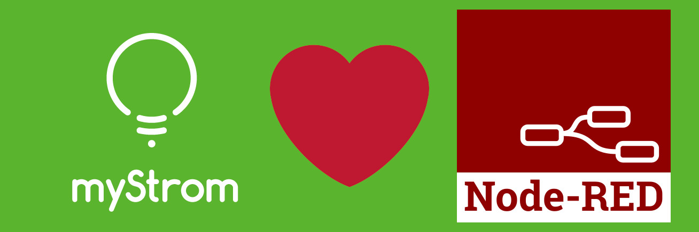

   

### Features
- Control nodes via JSON input flows or by simply setting the values in the properties menu
- No external dependencies needed
- Full functionality of the myStrom api (TODO)
- Automatic discovery of myStrom devices (TODO)
- JSON generator through GUI (TODO)
- Status message of how the message was sent and if it succeeded (TODO)

### Installation
myStrom-Node-RED was written in **Node.js** v4.2.6 and tested on Node-RED v0.19.4.

To use it execute `npm install node-red-contrib-mystrom`.

### Execution (IMPORTANT!!!)
All devices can be controlled in two ways.

  1. Give a valid JSON payload as input. What is needed for a valid input can be seen under Usage.
  2. By specifing the wished function with via the property editor. This is the easier option and is recommended for newer users.

If both options are available i.e. (a valid JSON gets sent as input to a myStrom node which was already been setup with the property editor) the JSON input will be executed. This means **JSON takes precedence over the property editor**.

### Nodes

- [myStrom Switch](#mystrom-switch)
- [myStrom Bulb](#mystrom-bulb)
- [myStrom Light Strip](#mystrom-light-strip)

### Usage
Every request has to contain the following:

| Attribute | Type     | Description |
| :------------- | :------------- |:------------- |
| **ip**      | string       | IP address of the myStrom Device      |
| **mac**      | string       | MAC address of the myStrom Device      |
| **request**  |  enum[ see list for each device] | Request we want to execute  |
| data   | array[ key, value ]  | *Optional* parameter used to further specified the request. |

The elements which are valid options for the request field are specified per-device and can be found below.

---

### myStrom Switch

Change the state of the switch, get the room temperature or get diagnostic info about the switch.

| Valid requests | Type    | Description|
| :------------- | :------------- |:------------- |
| `on`       | string       | Turns the switch on |
| `off`   | string  | Turns the switch off  |
| `toggle`   | string  | toggles the switch  |
| `report`   | string  | Get diagnostic information  |
| `temp`   | string  | Get room temperature in celsius |

##### Examples
To turn the switch on:

      { "ip": "192.168.1.00",
        "mac": "00:00:00:00:00:00"
        "request":  "on"
      }

To turn the switch off:

    { "ip": "192.168.1.00",
      "mac": "00:00:00:00:00:00"
      "request":  "on"
    }

The api documentatino of the switch can be found [here.](https://mystrom.ch/wp-content/uploads/REST_API_WSE.txt "myStrom Switch documentation")

### myStrom Bulb

Change the state of the bulb, change the colour and set the speed (ramp) of the transition

| Valid requests | Type    | Description|
| :------------- | :------------- |:------------- |
| `on`       | string       | Turns the bulb on |
| `off`   | string  | Turns the bulb off  |
| `toggle`   | string  | toggles the bulb  |
| `report`   | string  | Get diagnostic information  |
| `color`   | string  | *Needs additional data array*. See below for specification|

| Valid data | Type    | Need for request | Format| Description|
| :------------- | :------------- |:------------- |:------------- |:------------- |
| `color`       | string       | `color`|Must be in RGBW format and start with a '#' |Specifies the color which the bulb should be set to. Only used if the request is set to color. |
| `ramp`   | int  | `color` | Must be a positive number. |Specify the transition time in miliseconds.|

##### Examples:
To turn the bulb on:

    { "ip": "192.168.1.00",
      "mac": "00:00:00:00:00:00"
      "request":  "on"
    }

To turn the bulb red with a slow transition:

    { "ip": "192.168.1.00",
      "mac": "00:00:00:00:00:00"
      "request":  "color",
      "data": {
        "color": "#ff000000",
        "ramp": "1000"
      }
    }

The api documentatino of the bulb can be found [here.](https://mystrom.ch/wp-content/uploads/REST_API_WRB-2.txt "myStrom Bulb")

### myStrom Light Strip

Change the state of the light strip, change the colour and set the speed (ramp) of the transition

| Valid requests | Type    | Description|
| :------------- | :------------- |:------------- |
| `on`       | string       | Turns the light strip on |
| `off`   | string  | Turns the light strip off  |
| `toggle`   | string  | toggles the light strip  |
| `report`   | string  | Get diagnostic information  |
| `color`   | string  | *Needs additional data array*. See below for specification|

| Valid data | Type    | Need for request | Format| Description|
| :------------- | :------------- |:------------- |:------------- |:------------- |
| `color`       | string       | `color` |Must be in RGBW format and start with a '#' |Specifies the color which the light strip should be set to. |
| `ramp`   | int  | `color` | Must be a positive number between 0 and 1000. |Specifies the time it takes to transition to new color in miliseconds.|

##### Examples:
To turn the light strip on:

    { "ip": "192.168.1.00",
      "mac": "00:00:00:00:00:00"
      "request":  "on"
    }

To turn the light strip red with a slow transition:

    { "ip": "192.168.1.00",
      "mac": "00:00:00:00:00:00"
      "request":  "color",
      "data": {
        "color": "#ff000000",
        "ramp": "1000"
      }
    }

The api documentatino of the light strip can be found [here.](https://mystrom.ch/wp-content/uploads/REST_API_WRS-1.txtt "myStrom light strip")

### myStrom Button+

Make sure port 7980 is open on your node red server

Normally button accesses a website directly, but we also created a  button receiver in order to be able to use the buttons easyily as triggers in node red
